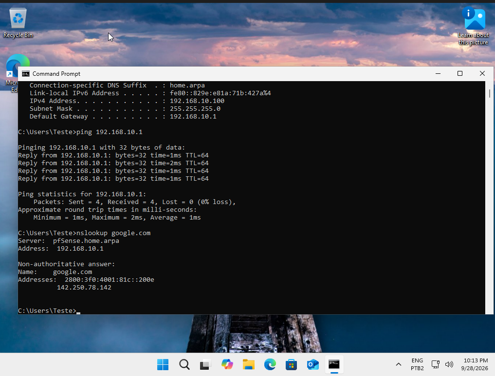
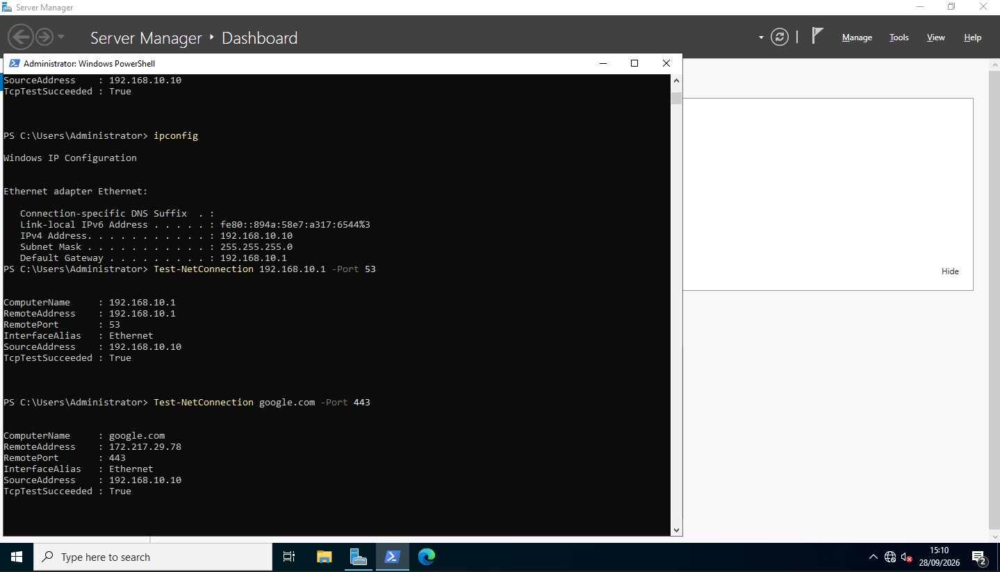
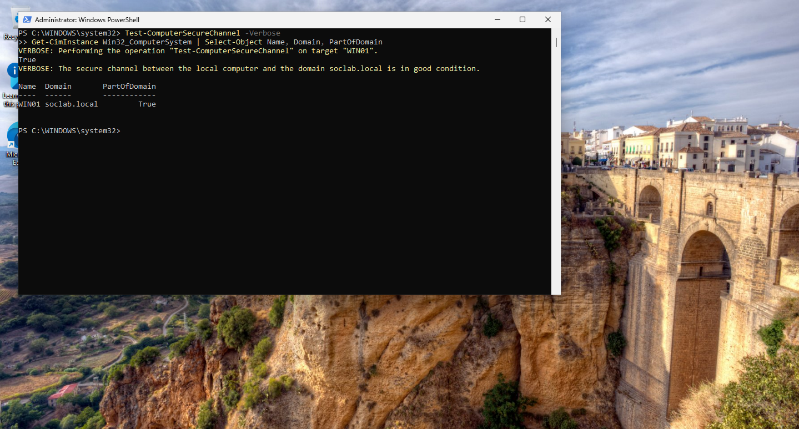
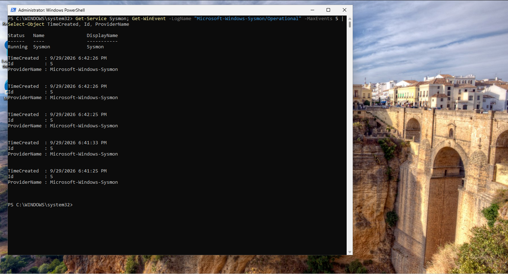
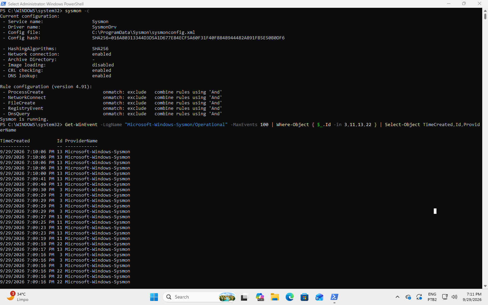
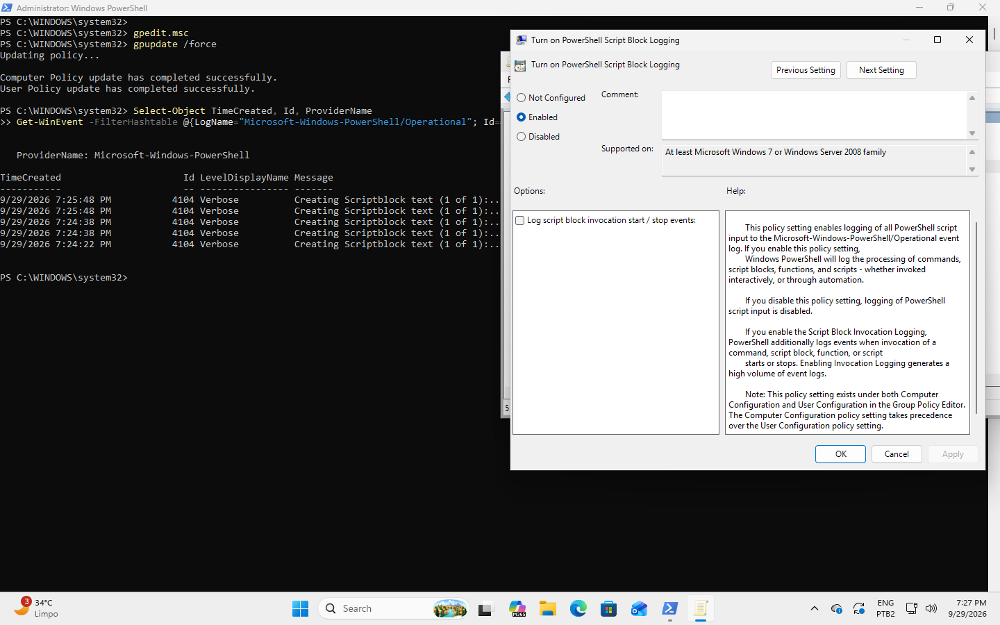
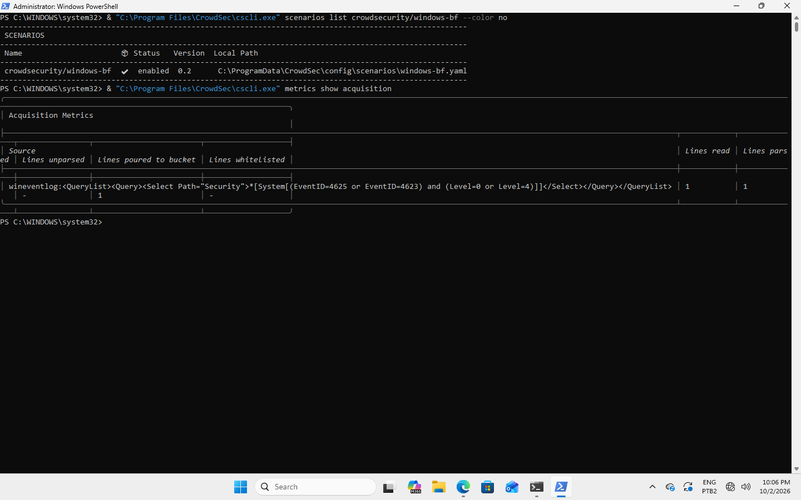

# Lab Checkpoints

## Phase 1 - Network Infrastructure

### Checkpoint 01 - WIN01 GREEN Network Connectivity

**Status:** Validated

**Date:** 2026-09-28

#### WIN01 Network Configuration

| Parameter | Value |
|---|---|
| VM | WIN01 |
| Network | SOC-GREEN |
| IPv4 | `192.168.10.100` |
| Subnet | `192.168.10.0/24` |
| Subnet Mask | `255.255.255.0` |
| Default Gateway | `192.168.10.1` |
| DNS Server | `192.168.10.1` |
| DNS Suffix | `home.arpa` |

#### Validation

- DHCP address assignment: PASS
- WIN01 -> pfSense connectivity: PASS
- DNS resolution through pfSense: PASS
- Internet connectivity: PASS

#### Evidence

The screenshot documents the network configuration assigned to WIN01 and the successful connectivity test to the pfSense gateway.

## Phase 2 - Active Directory

### Checkpoint 02 - DC01 Active Directory Deployment

**Status:** Validated

**Date:** 2026-09-28

#### DC01 Network Configuration

| Parameter | Value |
|---|---|
| VM | DC01 |
| Network | SOC-GREEN |
| IPv4 | `192.168.10.10` |
| Subnet | `192.168.10.0/24` |
| Subnet Mask | `255.255.255.0` |
| Default Gateway | `192.168.10.1` |
| DNS Server | `127.0.0.1` / `::1` |
| DNS Suffix | `soclab.local` |

#### Active Directory Configuration

| Parameter | Value |
|---|---|
| Hostname | `DC01` |
| Domain | `soclab.local` |
| NetBIOS Domain | `SOCLAB` |
| Role | Active Directory Domain Services |
| Global Catalog | Enabled |
| DNS | Active Directory-integrated |

#### Validation

- Static IP configuration: PASS
- Gateway connectivity: PASS
- AD DS installation: PASS
- Domain deployment: PASS
- DNS configuration: PASS
- DNS diagnostic (`dcdiag /test:DNS`): PASS
- DC hostname configuration: PASS

#### Evidence

**Evidence 01 - DC01 Network Validation**

The screenshot documents the network configuration and connectivity validation performed on DC01 before the Active Directory deployment, including DNS connectivity through port 53 and HTTPS connectivity through port 443.

#### WIN01 Domain Integration

| Parameter | Value |
|---|---|
| Hostname | `WIN01` |
| Operating System | Windows 11 Pro |
| Domain | `soclab.local` |
| Domain Membership | `True` |
| Secure Channel | Healthy |

**Validation Date:** 2026-09-29

#### Validation

- Windows 11 Pro installation: PASS
- Domain membership: PASS
- Hostname configuration: PASS
- Secure channel (`Test-ComputerSecureChannel`): PASS

#### Evidence

**Evidence 02 - WIN01 Domain Integration**

The screenshot documents the successful integration of WIN01 into the `soclab.local` Active Directory domain and the healthy secure channel between WIN01 and the domain.
## Phase 3 - Telemetry

### Checkpoint 03 - WIN01 Sysmon, PowerShell & CrowdSec Telemetry

**Status:** Validated

**Date:** 2026-10-02

#### Sysmon Configuration

| Parameter | Value |
|---|---|
| VM | WIN01 |
| Operating System | Windows 11 Pro |
| Component | Sysmon |
| Service Status | Running |
| Config File | `C:\ProgramData\Sysmon\sysmonconfig.xml` |
| Hashing Algorithm | SHA256 |
| Network Connection | Enabled |
| Operational Log | `Microsoft-Windows-Sysmon/Operational` |

#### PowerShell Logging Configuration

| Parameter | Value |
|---|---|
| Feature | PowerShell Script Block Logging |
| Status | Enabled |
| Operational Log | `Microsoft-Windows-PowerShell/Operational` |
| Event ID | 4104 |

#### CrowdSec Configuration

| Parameter | Value |
|---|---|
| VM | WIN01 |
| Component | CrowdSec Security Engine |
| Service Status | Running |
| Version | 1.8.1 |
| Windows Collection | `crowdsecurity/windows` |
| Scenario | `crowdsecurity/windows-bf` |
| Acquisition Source | Windows Security Event Log |
| Monitored Events | 4625, 4623 |
| Configuration File | `C:\ProgramData\CrowdSec\config\acquis.yaml` |

#### Events Monitored

- Event ID 1 — Process Create
- Event ID 3 — Network Connection
- Event ID 11 — File Create
- Event ID 13 — Registry Value Set
- Event ID 22 — DNS Query
- Event ID 4104 — PowerShell Script Block Logging
- Event ID 4625 — Failed Logon (CrowdSec acquisition)
- Event ID 4623 — Logoff (CrowdSec acquisition)

#### Validation

- Sysmon feature enabled: PASS
- Sysmon service installation: PASS
- Sysmon service status: PASS
- XML configuration validated: PASS
- Configuration successfully applied: PASS
- Network connection monitoring: PASS
- Event ID 1 generation: PASS
- Event ID 3 generation: PASS
- Event ID 11 generation: PASS
- Event ID 13 generation: PASS
- Event ID 22 generation: PASS
- PowerShell Script Block Logging enabled: PASS
- Event ID 4104 generation: PASS
- CrowdSec installation: PASS
- CrowdSec service status: PASS
- `crowdsecurity/windows` collection enabled: PASS
- Windows Security Event acquisition: PASS
- Event ID 4625 acquired by CrowdSec: PASS
- Event parsed successfully by CrowdSec: PASS
- `crowdsecurity/windows-bf` enabled: PASS
- Active CrowdSec alert: Not generated during validation

#### Evidence

**Evidence 01 - WIN01 Sysmon Installation**

The screenshot documents the Sysmon service running on WIN01 and the availability of the Sysmon operational log.

**Evidence 02 - WIN01 Sysmon Telemetry Validation**

The screenshot documents the active Sysmon configuration and the generation of network, file creation, registry, and DNS telemetry events during controlled validation tests.

**Evidence 03 - WIN01 PowerShell Script Block Logging**

The screenshot documents PowerShell Script Block Logging enabled on WIN01 and the generation of Event ID 4104 in the PowerShell operational log.

**Evidence 04 - WIN01 CrowdSec Validation**

The screenshot documents the CrowdSec Windows collection, the enabled `windows-bf` scenario, and successful acquisition and parsing of Windows Security events.
